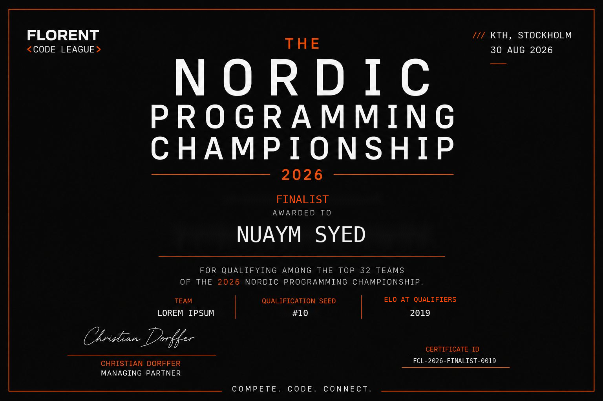
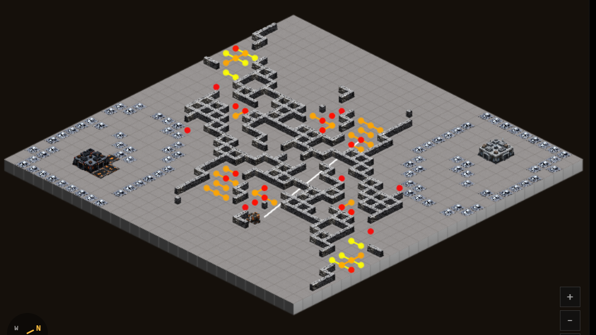
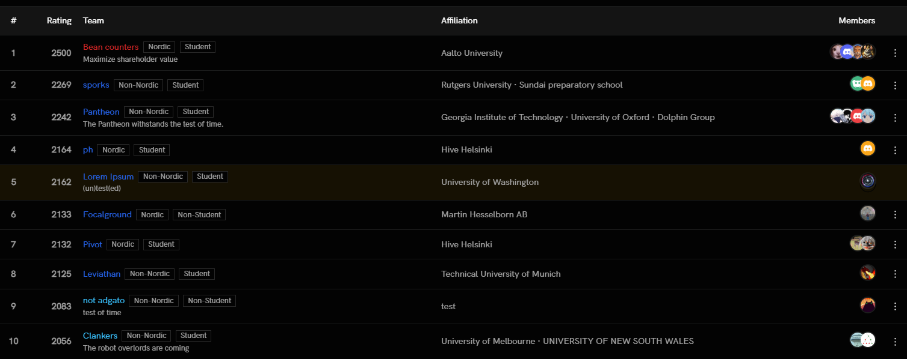

# Florent Code League 2026

Tldr a startup accelerator firm based in the Nordics (Florent) bought infrastructure from [Cambridge Battlecode](https://coderz75.github.io/post.html?p=cambc26) and modified the game slightly.

Unlike Cambridge Battlecode and MIT Battlecode, you likely would not find some LinkedIn post about it (from me) or find this on my resume explained in depth. There are a number of factors contributing to this, but here are a couple of my thoughts.

(For the sake of this article, I assume all of you have an adequate understanding of the game. Docs are [here](https://game.code.florent.vc/docs/florent-code-league). You can see the final being broadcasted [here](https://youtube.com/live/DtcBlwvqDeg?feature=share). Like previous tournaments, I did not attend.)

## The good

This time, I decided to go back to being a solo-team and registered under the name `Lorem Ipsum` (like I did at MIT battlecode). One of my teammates from Cambridge Battlecode had joined another team (the first place team from there) and I was talking about joining a team with the other. However, we ended up not competing together since I feared I wouldn't be able to contribute in the later stages of the game (as I would begin to travel)

Despite those setbacks, I managed to qualify for the final tournament at 10th seed. Using elo-tiebreaks, I placed exactly 10th place. My performance at the tournament was lackluster (for reasons I will explain in a second)

While I decided I would not be writing a postmortem for this event, some interesting things I did was I was able to implement full-map chokepoint detection and terrain analysis in a single compute term, average compute time for each individual bot averaging under 2 second (time limit for Cambridge Battlecode). However, this game had a 10 second time limit per bot, so I was well under.

Other things was bitmask-pathfinding, powerful flow systems, etc.

## The... not-so-good
There were a couple of... not-so-good things in this competition. 

### The game itself
Due to the addition of global ammo from Cambridge Battlecode, building gunners and sentinels became much easier. This led to rapidly approaching the enemy's core and spam-building turrets to being a powerful strategy. The game where I was eliminated inwas against team `not-adgato`, which was one of the original developers (and objectively the best) at this rush strategy.

### The decisions/management
Before I start this, I would like to iterate that I do not intend to demouth Florent or the league itself, or any of their sponsors. Managing something like this is hard and it is impossible to appease everyone, especially since this was the first time they ran this. However there were a couple of decisions I disagreed with.

One thing I didn't like was the prize distribution. How it worked was that despite Internationals and Nordics competing in the same tournament, they have different prize divisions. Furthermore, in each division only the top 3 earn the prize (5k euros for first, 3k euros for second, 2k euros for third). In my opinion, I heavily disagree with the top-3 structure, as well as the region-based prizes. The tournament was not set up for this, and it would be better to have lesser but universal prizes for the top 5. 

Another thing is that while I don't think this ever acually become relevant in my case, they released that tiebrakes for prizes in the internation and nordic segments will be based elo tiebreaks after the submission cutoff. Something like this affects what bots people would run, as well as overall strategy. Many teams assumed elo to be only useful for seeding, and past that elo is irrelevant. They ideally should have released this decision a couple days before the cutoff.

Another thing I heavily disliked was how they did not leave time for "convergence." To explain, convergence refers to running a number of ranked ladder matched post cutoff so last-minute submissions can be placed adequately and effectively. It's roughly been 5 days after ranked games have been restarted, and here is the new leaderboard: 

</img>

First thing I would like to point out is now Lorem Ipsum is 5th seed, up 5 places. Second thing I would like to point out is teams like Sporks, who participated in the tournament at 11th seed, is now second in elo. Sporks did not win any prizes and got 4th in international rankings. Similarly, Leviathan, second in internation (third overall) in the tournament, dropped to 8th seed.

Seeding matters a lot. With this seeding the overall result of the tournament would have been significantly different. Despite being requested in advanced multiple times, as well as after the elo tiebreak announcement, the organizers had decided to not leave time for convergence.

# Conclusion
So... yeah. This is far from my favorite tournament that I ever participated in. I am not trying to be salty, since I think decisions made affected multiple teams, including mine. Despite this I learned to iterate and learned more analysis and ideas, so there is that.

I would like to reiterate I am not trying to attack the organizers, Florent, or their sponsors. I am also not trying to attack any of the teams that won prizes or did well. They all tried really hard and had very powerful bots. It has been a pleasure competing with all of you. 